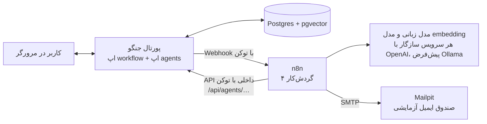

# فاز ۳ — لایه‌ی عامل‌های هوش مصنوعی در n8n

این سند توضیح می‌دهد در فاز ۳ چه چیزی ساخته شده، چرا این‌طور طراحی شده، و چطور آن را اجرا و آزمایش کنید.

## ۱. معماری در یک نگاه



سه اصل که در کل کد رعایت شده است:

1. **انسان‌در‌حلقه.** هیچ عاملی وضعیت پرونده را عوض نمی‌کند. کد عامل‌ها هیچ‌جا `perform()` را صدا نمی‌زند؛ خروجی آن‌ها فقط «نمایش داده می‌شود» (بازخورد، فهرست پیشنهادی، پاسخ، ایمیل).
2. **پورتال بدون عامل‌ها هم کار می‌کند.** با `AGENTS_ENABLED=False` پورتال دقیقاً همان فاز ۲ است. اگر n8n یا مدل زبانی خاموش باشد، فقط همان عامل «انجام نشد» نشان می‌دهد و گردش‌کار اصلی ادامه دارد.
3. **قاعده در پورتال، زبان در n8n.** هر چیزی که باید «دقیق» باشد (چه کسی واجد شرایط داوری است، چه مهلتی سررسید شده، ایمیل برای چه کسی برود) در جنگو و با قواعد قطعی حساب می‌شود. مدل زبانی فقط کار «زبانی» می‌کند: تشخیص بخش‌های سند، جمله‌بندی پاسخ و پیام، توجیه یک‌جمله‌ای.

پورتال هیچ‌وقت مستقیم با مدل زبانی حرف نمی‌زند؛ همه‌ی فراخوانی‌های هوش مصنوعی از n8n می‌گذرد.

## ۲. نقشه‌ی فایل‌ها

| مسیر | کار |
|---|---|
| `agents/models.py` | جدول‌های خروجی عامل‌ها: `DocumentValidation`، `PolicyChunk`، `AssistantMessage`، `SuggestionRun`، `RefereeSuggestion`، `Notification` |
| `agents/services.py` | منطق سمت پورتال برای هر چهار عامل (مهم‌ترین فایل) |
| `agents/signals.py` | اتصال به گردش‌کار: پس از ثبت هر `CaseEvent` عامل‌ها خبر می‌شوند |
| `agents/n8n.py` | تنها نقطه‌ی تماس پورتال با n8n (یک تابع `post`) |
| `agents/api.py` | API داخلی که n8n صدا می‌زند (با سرآیند `X-Agent-Token`) |
| `agents/checklist.py` | چک‌لیست قالب فرم پیشنهاد (۸ بخش + ۵ فیلد) — فقط داده |
| `agents/extract.py` | استخراج متن از PDF و DOCX و یکدست‌سازی متن فارسی |
| `agents/chunking.py` | قطعه‌بندی سند رویه بر اساس عنوان‌ها و شماره‌ی بندها |
| `agents/knowledge/` | اسنادی که در پایگاه دانش نمایه می‌شوند |
| `agents/management/commands/` | `index_policy`، `agents_check`، `run_reminders` |
| `agents/tests.py` | ۵۰ آزمون خودکار (n8n در آن‌ها ساختگی است) |
| `n8n/workflows/*.json` | چهار گردش‌کار n8n |
| `n8n/import.sh` | وارد کردن و فعال‌کردن گردش‌کارها با یک دستور |
| `workflow/rules.py` | قاعده‌ی یادآوری مهلت: `REMINDER_DAYS` و `reminder_stage` |

در کد فاز ۲ فقط چند خط عوض شده است: سه قالب (نمایش خروجی عامل‌ها)، فرم تخصیص داور (ترتیب پیشنهادی) و تنظیمات. در `workflow/services.py` (موتور گردش‌کار) فقط دو توضیح به‌روز شده و هیچ منطقی تغییر نکرده است.

## ۳. چهار عامل

### عامل ۱ — اعتبارسنجی سند (`01-document-validation.json`)

- **چه زمانی:** بلافاصله پس از بارگذاری هر نسخه‌ی «پیشنهاد».
- **پورتال:** متن فایل را استخراج می‌کند و همراه چک‌لیست به `validate-proposal` می‌فرستد. اگر متنی استخراج نشود (مثلاً PDF اسکن‌شده) همان‌جا خطا می‌دهد و چیزی به n8n نمی‌رود.
- **n8n:** متن را به تکه‌های ۴۰۰۰ نویسه‌ای می‌شکند (چون کل پیشنهاد در پنجره‌ی ورودی مدل‌های محلی جا نمی‌شود) ← مدل زبانی برای هر تکه می‌گوید کدام موارد چک‌لیست را می‌بیند و برای هرکدام **نقل‌قولی از متن** می‌آورد ← گره‌ی `Aggregate And Verify` بررسی می‌کند آن نقل‌قول واقعاً در همان تکه هست؛ اگر نبود، ادعای مدل پذیرفته نمی‌شود ← نتیجه به پورتال برمی‌گردد.
- **کجا دیده می‌شود:** صفحه‌ی پرونده، زیر هر نسخه‌ی پیشنهاد، کادر «بررسی خودکار قالب».
- **مانع ارسال نیست؛** فقط بازخورد است.

### عامل ۲ — دستیار RAG (`02-rag-assistant.json`)

- **نمایه‌سازی (یک‌بار):** `python manage.py index_policy` سند را قطعه‌بندی می‌کند، بردار هر قطعه را از `rag-embed` می‌گیرد و در جدول `PolicyChunk` (ستون `vector` از pgvector) ذخیره می‌کند.
- **پرسش:** دکمه‌ی «دستیار آیین‌نامه» پایین صفحه ← `rag-ask` ← بردار پرسش ← جست‌وجوی ۵ قطعه‌ی نزدیک‌تر در پورتال (`/api/agents/rag/search/`، شباهت کسینوسی) ← مدل زبانی فقط بر اساس همان قطعه‌ها پاسخ می‌دهد و شماره‌ی بند را می‌آورد.
- **سابقه:** هر پرسش و پاسخ در `AssistantMessage` ثبت می‌شود (داده‌ی ارزیابی سطح ۳ در فاز ۵).
- هر پرسش مستقل است (دستیار حافظه‌ی گفتگو ندارد).

### عامل ۳ — پیشنهاد داور (`03-referee-suggestion.json`)

- **چه زمانی:** وقتی پرونده به «در انتظار تخصیص داور» می‌رسد.
- **پورتال:** فهرست داوران واجد شرایط را با قاعده‌ی قطعی می‌سازد (عضو همان گروه، غیر از راهنما و نویسنده) و همراه «موضوع» (عنوان + ابتدای مقدمه) می‌فرستد.
- **n8n:** موضوع و «زمینه‌های تخصصی» هر استاد را به بردار تبدیل، با شباهت کسینوسی رتبه‌بندی و برای ۵ نفر اول یک توجیه یک‌جمله‌ای تولید می‌کند.
- **کجا دیده می‌شود:** بالای فرم «تخصیص داور» برای مدیر گروه. هیچ گزینه‌ای از پیش تیک نخورده است.
- پورتال دوباره بررسی می‌کند هر داور پیشنهادی واقعاً واجد شرایط باشد.

### عامل ۴ — اطلاع‌رسانی (`04-notifications.json`)

- **تغییر وضعیت:** پس از هر تغییر وضعیت، به کسی که اکنون نوبت اقدام اوست و به نویسنده ایمیل می‌رود (نه به خود اقدام‌کننده). متن نظر داور در ایمیل نمی‌آید.
- **یادآوری مهلت:** n8n هر روز ساعت ۸ فهرست یادآوری‌های سررسیدشده را از پورتال می‌گیرد. قاعده در `workflow/rules.py`: ۱۴، ۷، ۳، ۱ روز مانده، روز مهلت، و پس از آن هفته‌ای یک‌بار. هر یادآوری برای هر گیرنده فقط یک‌بار.
- **متن پیام:** مدل زبانی فقط جمله‌بندی می‌کند؛ اگر پاسخ ندهد متن ثابت پشتیبان فرستاده می‌شود. پانویس («پاسخ ندهید» + پیوند پورتال) همیشه ثابت است.
- **سابقه:** جدول `Notification` و کادر «اعلان‌های ایمیلی» در صفحه‌ی پرونده.

## ۴. راه‌اندازی

### ۴-۱. مدل زبانی

پیش‌فرض، [Ollama](https://ollama.com) روی همین مک است (رایگان، بدون نیاز به کلید):

```bash
ollama pull gemma3:4b     # مدل گفتگو، حدود ۳ گیگابایت
ollama pull bge-m3        # مدل embedding چندزبانه، حدود ۱ گیگابایت
```

برنامه‌ی Ollama باید در حال اجرا باشد. برای استفاده از هر سرویس دیگرِ سازگار با OpenAI، سه متغیر `LLM_BASE_URL`، `LLM_API_KEY` و `LLM_CHAT_MODEL` (و در صورت نیاز `EMBEDDING_*`) را در `.env` عوض کنید؛ نمونه در `.env.example` هست.

### ۴-۲. تنظیمات

این خط‌ها را به `.env` اضافه کنید:

```
AGENTS_ENABLED=True
AGENT_TOKEN=یک-رشته‌ی-تصادفی-بلند
```

برای ساختن توکن: `python -c "import secrets; print(secrets.token_urlsafe(32))"`

### ۴-۳. اجرا

```bash
cd ~/conference-mgmt-system
source venv/bin/activate
pip install -r requirements.txt     # سه بسته‌ی تازه: pgvector، pypdf، python-docx
docker compose up -d                # ایمیج پایگاه‌داده عوض شده و Mailpit اضافه شده است
python manage.py migrate
python manage.py seed_demo          # کاربران نمونه اکنون ایمیل دارند
bash n8n/import.sh                  # گردش‌کارها را وارد و فعال می‌کند
python manage.py runserver
```

داده‌های پایگاه‌داده با عوض‌شدن ایمیج از بین نمی‌رود (همان Postgres 16 و همان volume).

اگر `n8n/import.sh` خطا داد، دستی وارد کنید: در n8n یک گردش‌کار تازه بسازید ← منوی سه‌نقطه ← **Import from File** ← فایل را از `n8n/workflows` انتخاب کنید ← **Publish** (در نسخه‌های قدیمی‌تر: کلید **Active**). برای گردش‌کار چهارم، گره‌ی **Send Email** به یک اعتبارنامه‌ی SMTP نیاز دارد: Host=`mailpit`، Port=`1025`، SSL/TLS خاموش، بدون نام کاربری و رمز.

### ۴-۴. بررسی اتصال و نمایه‌سازی

در یک ترمینال دیگر (با `venv` فعال):

```bash
python manage.py agents_check       # تنظیمات، n8n و مدل embedding را می‌آزماید
python manage.py index_policy       # نمایه‌سازی اسناد پوشه‌ی agents/knowledge
python manage.py agents_check --ask "حداقل فاصله‌ی تصویب پیشنهاد تا دفاع چقدر است؟"
```

**سند رویه‌ی AUT-PR-3210** در مخزن نیست. فایل آن را از سایت معاونت آموزشی بگیرید و نمایه کنید:

```bash
python manage.py index_policy ~/Downloads/AUT-PR-3210.pdf --code AUT-PR-3210 --dry-run   # اول قطعه‌ها را ببینید
python manage.py index_policy ~/Downloads/AUT-PR-3210.pdf --code AUT-PR-3210 \
    --title "چگونگی ثبت‌نام، تصویب، و دفاع از پایان‌نامه در مقطع کارشناسی"
```

تا آن زمان، پایگاه دانش فقط «توضیحات ۱ تا ۵» و بخش تأیید داوران از فرم پیشنهاد پروژه را دارد (`agents/knowledge/FORM-PROPOSAL.md`).

## ۵. آزمون

### ۵-۱. آزمون‌های خودکار

```bash
python manage.py test               # همه (فاز ۲ + فاز ۳)
python manage.py test agents        # فقط فاز ۳
```

این آزمون‌ها به n8n و مدل زبانی نیاز ندارند (فقط پایگاه‌داده باید بالا باشد).

### ۵-۲. آزمون دستی (رمز همه‌ی کاربران نمونه: `test1234`)

| # | کار | نتیجه‌ی مورد انتظار |
|---|---|---|
| ۱ | با `student2` وارد شوید ← ثبت پرونده‌ی جدید ← انتخاب استاد راهنما ← بارگذاری یک پیشنهاد واقعی (DOCX یا PDF) | زیر نسخه، «در حال بررسی…» و چند لحظه بعد نتیجه‌ی چک‌لیست |
| ۲ | یک نسخه‌ی ناقص بارگذاری کنید (مثلاً بخش «روش ارزیابی» را حذف کنید) | همان بخش با ✗ قرمز |
| ۳ | دکمه‌ی «دستیار آیین‌نامه» ← «مهلت تحویل پیشنهاد پروژه چقدر است؟» | پاسخ با شماره‌ی بند و فهرست «بندهای مرجع» |
| ۴ | «ارسال پیشنهاد برای استاد راهنما» | در Mailpit (<http://localhost:8025>) یک ایمیل برای `advisor1` |
| ۵ | با `advisor1` تأیید ← با `edu1` «ثبت دریافت» ← با `head1` فرم «تخصیص داور» را باز کنید | کادر «پیشنهاد سامانه برای داور» با رتبه، درصد شباهت و توجیه |
| ۶ | `python manage.py run_reminders --days-ahead 54 --dry-run` (حدود یک هفته پیش از مهلت تحویل پیشنهادِ پرونده‌ای که امروز ثبت شده) | فهرست یادآوری‌هایی که در آن روز سررسید می‌شوند، با گیرنده و موضوع هرکدام |
| ۷ | همان دستور بدون `--dry-run`، سپس دوباره با `--dry-run` | ایمیل‌ها در Mailpit؛ بار دوم «۰ یادآوری» (تکراری فرستاده نمی‌شود) |
| ۸ | Ollama را ببندید و یک تغییر وضعیت انجام دهید | پورتال کار می‌کند؛ ایمیل با متن ثابت پشتیبان می‌رسد |

اجرای هر گردش‌کار را در n8n (<http://localhost:5678>) بخش **Executions** و همه‌ی خروجی عامل‌ها را در پنل ادمین، بخش «عامل‌های هوش مصنوعی» می‌بینید.

## ۶. عیب‌یابی

| نشانه | علت محتمل و راه‌حل |
|---|---|
| `agents_check` می‌گوید n8n پاسخ نمی‌دهد | `docker compose ps`؛ اگر n8n بالا نیامده `docker compose logs n8n` |
| `HTTP 404` از یک Webhook | گردش‌کار فعال (Published) نیست، یا پس از `import.sh` هنوز n8n دوباره بالا نیامده |
| اجرا در n8n با خطای `Unauthorized` | `AGENT_TOKEN` پس از تغییر `.env` به کانتینر نرسیده: `docker compose up -d` |
| خطای `access to env vars denied` در n8n | متغیر `N8N_BLOCK_ENV_ACCESS_IN_NODE=false` اعمال نشده: `docker compose up -d` |
| گره‌ی `LLM …` یا `Embed …` خطای اتصال می‌دهد | Ollama در حال اجرا نیست یا مدل دانلود نشده (`ollama list`) |
| گره‌ی `Send Result To Portal` خطا می‌دهد | سرور جنگو روشن نیست. اگر روشن است و باز هم وصل نمی‌شود: `python manage.py runserver 0.0.0.0:8000` |
| بررسی قالب «بی‌پاسخ ماند» | اجرای مربوط را در Executions باز کنید و گره‌ی قرمز را ببینید |
| دستیار می‌گوید پایگاه دانش نمایه نشده | `python manage.py index_policy`؛ پس از عوض‌کردن `EMBEDDING_MODEL` هم باید دوباره اجرا شود |
| هشدار `collation version mismatch` در لاگ Postgres | `docker compose exec db psql -U dev -d conference_db -c "ALTER DATABASE conference_db REFRESH COLLATION VERSION"` |
| متن استخراج‌شده از PDF فارسی به‌هم‌ریخته است | استخراج متن راست‌به‌چپ از PDF بی‌نقص نیست؛ DOCX مطمئن‌تر است. برای سند رویه با `--dry-run` قطعه‌ها را ببینید و در صورت نیاز متن را در یک فایل `.md` بگذارید |

## ۷. محدودیت‌ها و کارهای فاز ۴ و ۵

- پرامپت‌ها هنوز با مدل واقعی تنظیم نشده‌اند؛ کیفیت تشخیص و پاسخ باید در فاز ۵ با داده‌ی آزمایشی اندازه‌گیری و پرامپت‌ها (در گره‌های Code گردش‌کارها) اصلاح شوند.
- چک‌لیست «بخش‌های هشت‌گانه» بر اساس متن فرم پیشنهاد فرض شده است (عنوان + هفت بخش). اگر تعریف دانشکده متفاوت است فقط `agents/checklist.py` را ویرایش کنید.
- توکن مشترک و `N8N_BLOCK_ENV_ACCESS_IN_NODE=false` برای محیط توسعه مناسب است؛ برای استقرار واقعی باید از اعتبارنامه‌های n8n و HTTPS استفاده شود.
- ارسال پیامک و «پیشنهاد استاد راهنما» پیاده نشده‌اند (در فهرست فاز ۳ نبودند).
