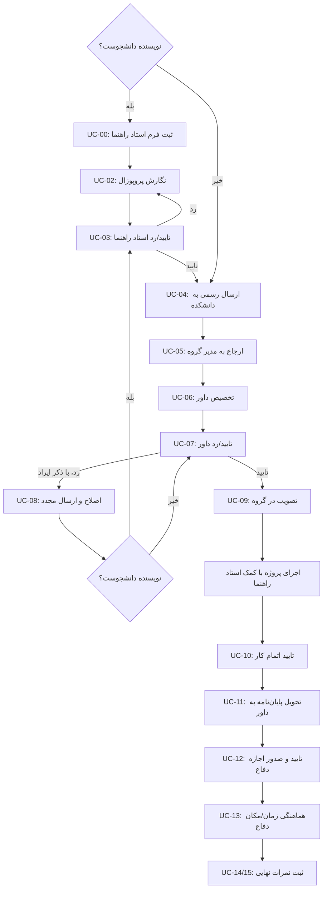

# سند تحلیل نیازمندی‌ها و مدل‌سازی مفهومی — فاز ۲ (نسخه ۳)

> این سند خروجی فاز ۲ پروژه است: شناسایی ذینفعان، شرح کامل فرایند، موارد استفاده، واژه‌نامه داده، و قواعد کسب‌وکار سامانه مدیریت کنفرانس — پیش از ورود به فاز ۳ (توصیف صوری با Z).

**تغییرات نسبت به نسخه ۲:** بازنویسی کامل فرایند بر اساس شرح دقیق شما — افزودن نقش مدیر گروه، تفکیک «تایید پروپوزال توسط استاد راهنما» از «ارسال رسمی به دانشکده»، ارجاع بر اساس شاخه/گروه استاد راهنما، چرخه اصلاح که نیازمند تایید مجدد استاد راهنماست، تصویب گروه، مراحل پس از تصویب (اجرای پروژه، تحویل پایان‌نامه، اجازه دفاع، هماهنگی دفاع، ثبت نمرات نهایی)، و مکانیزم امتیاز زمان‌بندی که فقط شامل نویسنده دانشجو می‌شود.

> 📌 **نکته طراحی:** طبق گفته خودتان، این فرایند در دنیای واقعی عمدتاً از طریق **ایمیل** انجام می‌شود، نه یک سامانه. در این پروژه، ما نقاط تصمیم‌گیری و رویدادهای گسسته (تایید/رد، ثبت نمره، مهلت‌های زمانی) را به‌صورت عملیات رسمی سیستم مدل می‌کنیم — چون این‌ها همان چیزهایی هستند که با Z قابل مشخصه‌سازی‌اند. خودِ کانال ارتباطی (ایمیل در مقابل اعلان درون‌سیستمی) یک جزئیات پیاده‌سازی است و در مدل صوری اهمیتی ندارد.

> ⚠️ این نسخه مدل را نسبتاً بزرگ کرده (نزدیک به ۲۰ مورد استفاده). در بخش ۶ پیشنهادی برای مدیریت این حجم در Z (با schema inclusion) آورده‌ام، اما همچنان توصیه می‌کنم دامنه را با استاد راهنمای خودتان از نظر تناسب با ۱۴ هفته چک کنید.

---

## ۱. ذینفعان (Stakeholders)

| ذی‌نفع | معادل واقعی در دانشگاه | مسئولیت‌های اصلی |
|---|---|---|
| **نویسنده (Author)** | دانشجو (یا عضو هیئت‌علمی) | تعیین استاد راهنما، نگارش و ارسال پروپوزال، اصلاح در صورت رد، اجرای پروژه، تحویل پایان‌نامه، هماهنگی دفاع |
| **استاد راهنما (Advisor)** | استاد راهنمای پروژه | تایید/رد پروپوزال پیش از ارسال رسمی، راهنمایی در طول اجرای پروژه، تایید اتمام پروژه/پایان‌نامه، ثبت نمره نهایی — **فقط برای نویسنده دانشجو** |
| **مدیر گروه (Group Manager)** | مدیر گروه آموزشی (نرم‌افزار/سخت‌افزار/شبکه/هوش‌مصنوعی) | تخصیص داور(ها) از میان اساتید گروه، تصویب نهایی پروژه پس از تایید داور |
| **داور (Reviewer)** | استاد داور | تایید/رد پروپوزال (با ذکر ایراد در صورت رد)، تایید پایان‌نامه و صدور اجازه دفاع، ثبت نمره نهایی |
| **مدیر کنفرانس (Chair)** | آموزش دانشکده | دریافت فرم انتخاب استاد راهنما، دریافت پروپوزال تاییدشده، ارجاع آن به مدیر گروه مربوطه، هماهنگی زمان/مکان دفاع، پیگیری مهلت‌های زمانی |

### نکات مهم

- نویسنده دو نوع دارد: `Student` یا `Professor`. این نوع تعیین می‌کند که آیا استاد راهنما و مکانیزم امتیاز زمان‌بندی وجود دارد یا نه، و حداقل تعداد داور چقدر است (بخش ۵).
- **استاد راهنما، مدیر گروه، و مکانیزم امتیاز زمان‌بندی، فقط برای نویسنده دانشجو معنا دارند.** برای نویسنده غیردانشجو (استاد)، فرایند از همان ابتدا مستقیم به تخصیص داور می‌رسد.
- کمک و راهنمایی استاد راهنما در حین اجرای پروژه، یک تعامل انسانی مستمر است و خارج از دامنه‌ی عملیات‌های گسسته قابل مدل‌سازی با Z قرار می‌گیرد؛ فقط نقاط تصمیم رسمی آن (تایید پروپوزال، تایید اتمام کار، نمره نهایی) در سامانه مدل می‌شوند.

---

## ۲. شرح کامل فرایند (روایت گام‌به‌گام)

این بخش دقیقاً مسیر واقعی را که شرح دادید، به ترتیب و با ارجاع به شناسه‌های موارد استفاده (UC) و قواعد کسب‌وکار (BR) در بخش‌های بعد، بازنویسی می‌کند.

**مرحله ۱ — تعیین استاد راهنما (فقط نویسنده دانشجو):**
دانشجو استاد راهنمای خود را تعیین می‌کند (این انتخاب خودش خارج از سیستم است) و فرم آن را به مدیر کنفرانس (آموزش) تحویل می‌دهد. اگر این کار در بازه زمانی مقرر انجام شود، امتیاز کامل این مرحله ثبت می‌شود؛ در غیر این صورت امتیاز از دست می‌رود. → `UC-00` / `BR1`

**مرحله ۲ — نگارش پروپوزال و تایید استاد راهنما:**
دانشجو پروپوزال را می‌نویسد و باید ابتدا تایید استاد راهنمای خود را بگیرد. تا وقتی این تایید گرفته نشده، پروپوزال قابل ارسال رسمی نیست. → `UC-02`, `UC-03` / `BR2`

**مرحله ۳ — ارسال رسمی پروپوزال به دانشکده:**
پس از تایید استاد راهنما، دانشجو پروپوزال را رسماً به مدیر کنفرانس (آموزش) ارسال می‌کند. اگر در بازه زمانی مقرر باشد، امتیاز این بخش کامل ثبت می‌شود. → `UC-04` / `BR3`

**مرحله ۴ — ارجاع به مدیر گروه بر اساس شاخه:**
بر اساس موضوع پروژه و گروهی که استاد راهنما عضو آن است (یکی از چهار گروه: نرم‌افزار، سخت‌افزار، شبکه، هوش‌مصنوعی)، مدیر کنفرانس پروپوزال را به مدیر همان گروه ارجاع می‌دهد. → `UC-05` / `BR4`

**مرحله ۵ — تخصیص داور توسط مدیر گروه:**
مدیر گروه، داور (یا داوران) پروژه را از میان اساتید همان گروه تعیین می‌کند و فهرست داوران را به مدیر کنفرانس (آموزش) اعلام می‌کند. → `UC-06` / `BR5`

**مرحله ۶ — تایید یا رد پروپوزال توسط داور:**
داور(ها) پروپوزال را بررسی و تایید یا رد می‌کنند. در صورت رد، ایرادات مشخص اعلام می‌شود. → `UC-07`

**مرحله ۷ — اصلاح و ارائه مجدد (در صورت رد):**
دانشجو باید اصلاحات لازم را اعمال کند، **دوباره تایید استاد راهنما را بگیرد** (بازگشت به مرحله ۲)، و مجدداً ارائه دهد. این چرخه می‌تواند چند بار تکرار شود تا تایید نهایی داور. → `UC-08` / `BR7`

**مرحله ۸ — تصویب پروژه در گروه:**
با تایید داور، پروژه در گروه تصویب می‌شود. اگر زمان‌بندی دانشجو تا این مرحله درست بوده، امتیاز این بخش (که به تصویب به‌موقع وابسته است) ثبت می‌شود. → `UC-09` / `BR8`

**مرحله ۹ — اجرای پروژه:**
دانشجو با کمک استاد راهنما پروژه را پیش می‌برد. این مرحله عمدتاً تعاملی/انسانی است و خارج از عملیات‌های گسسته سیستم قرار دارد. → `BR9`

**مرحله ۱۰ — تایید اتمام کار توسط استاد راهنما:**
پس از پایان کار، استاد راهنما باید تکمیل بودن پروژه و پایان‌نامه را تایید کند. → `UC-10` / `BR10`

**مرحله ۱۱ — تحویل پایان‌نامه به داور:**
دانشجو پایان‌نامه را به داور تحویل می‌دهد — حداقل یک هفته پیش از تاریخ دفاع. تاخیر در این مرحله باعث کسر نمره می‌شود. → `UC-11` / `BR11`

**مرحله ۱۲ — صدور اجازه دفاع:**
اگر پایان‌نامه مورد قبول داور باشد، اجازه دفاع صادر می‌شود. → `UC-12` / `BR12`

**مرحله ۱۳ — هماهنگی زمان و مکان دفاع:**
دانشجو برای تعیین زمان و مکان دفاع به دانشکده (مدیر کنفرانس) مراجعه می‌کند. تاخیر در برگزاری دفاع (نسبت به مهلت‌های نیمسالی) باعث کسر نمره کل می‌شود. → `UC-13` / `BR13`

**مرحله ۱۴ — ثبت نمرات نهایی:**
پس از برگزاری جلسه دفاع، نمره استاد راهنما و نمره داور به‌طور جداگانه ثبت می‌شود. → `UC-14`, `UC-15` / `BR14`

**مسیر نویسنده غیردانشجو:** مراحل ۱، ۲، ۳ (بخش استاد راهنما)، ۹، ۱۰ حذف می‌شوند و مکانیزم امتیاز زمان‌بندی اصلاً اعمال نمی‌شود؛ فرایند مستقیماً از ارسال پروپوزال (بدون نیاز به تایید پیشین کسی) به ارجاع بر اساس شاخه خودِ نویسنده و تخصیص حداقل ۲ داور می‌رسد. → `BR20`

---

## ۳. موارد استفاده اصلی (Use Cases)

| شناسه | نام مورد استفاده | بازیگر اصلی | فقط برای دانشجو؟ |
|---|---|---|---|
| UC-00 | ثبت فرم انتخاب استاد راهنما | نویسنده | بله |
| UC-01 | ورود و احراز هویت | همه نقش‌ها | خیر |
| UC-02 | نگارش پروپوزال و درخواست تایید استاد راهنما | نویسنده | بله |
| UC-03 | تایید/رد پروپوزال توسط استاد راهنما | استاد راهنما | بله |
| UC-04 | ارسال رسمی پروپوزال تاییدشده به مدیر کنفرانس | نویسنده | خیر (غیردانشجو مستقیماً اینجا وارد می‌شود) |
| UC-05 | ارجاع پروپوزال به مدیر گروه بر اساس شاخه | مدیر کنفرانس | خیر |
| UC-06 | تخصیص داور(ها) توسط مدیر گروه | مدیر گروه | خیر |
| UC-07 | تایید/رد پروپوزال توسط داور (با ذکر ایراد در صورت رد) | داور | خیر |
| UC-08 | اصلاح و ارسال مجدد پروپوزال | نویسنده | خیر (اما نیازمند تایید استاد راهنما فقط اگر دانشجو) |
| UC-09 | تصویب پروژه در گروه | مدیر گروه | خیر |
| UC-10 | تایید اتمام پروژه/پایان‌نامه توسط استاد راهنما | استاد راهنما | بله |
| UC-11 | تحویل پایان‌نامه/مقاله نهایی به داور | نویسنده | خیر |
| UC-12 | تایید پایان‌نامه و صدور اجازه دفاع | داور | خیر |
| UC-13 | هماهنگی زمان و مکان دفاع | نویسنده / مدیر کنفرانس | خیر |
| UC-14 | ثبت نمره نهایی داور | داور | خیر |
| UC-15 | ثبت نمره نهایی استاد راهنما | استاد راهنما | بله |
| UC-16 | اعلام تعارض منافع | داور | خیر |
| UC-17 | جمع‌بندی نمرات و تصمیم نهایی | مدیر کنفرانس | خیر |
| UC-18 | اعلام نتایج | مدیر کنفرانس | خیر |
| UC-19 | زمان‌بندی نشست‌های ارائه کنفرانس *(مستقل از دفاع فردی)* | مدیر کنفرانس | خیر |
| UC-20 | گزارش‌گیری آماری | مدیر کنفرانس | خیر |

### نمودار جریان کامل فرایند

*(نمای ساده‌شده؛ برخی گام‌های مختص نویسنده دانشجو با شرط جداگانه نشان داده شده‌اند.)*

---

## ۴. واژه‌نامه داده (Data Dictionary)

### User
| فیلد | نوع | توضیح |
|---|---|---|
| id | شناسه یکتا | |
| name, email | رشته | |
| roles | مجموعه‌ای از {Author, Advisor, Reviewer, Chair, GroupManager} | |
| authorType | {Student, Professor} — فقط اگر نقش Author دارد | |
| branch | {Software, Hardware, AI, Network} — برای Advisor/Reviewer/GroupManager و نویسنده غیردانشجو | |
| affiliation | رشته | اختیاری |

### Milestone *(جدید — مکانیزم امتیاز زمان‌بندی)*
| فیلد | نوع | توضیح |
|---|---|---|
| id | شناسه یکتا | |
| subjectId | ارجاع به Proposal یا Paper | |
| type | {AdvisorSelection, ProposalSubmission, GroupRatification, ThesisDelivery, Defense} | |
| deadline | تاریخ | |
| actualDate | تاریخ | |
| onTime | بولی (مشتق از مقایسه actualDate با deadline) | |
| scoreAwarded | عدد | |

**فقط وقتی `author.authorType = Student` باشد این رکوردها ایجاد می‌شوند.** مقادیر نمونه (بر اساس رویه فعلی دانشکده شما):

| نوع Milestone | مهلت نمونه | حداکثر امتیاز |
|---|---|---|
| AdvisorSelection | دوشنبه هفته ۵ نیمسال | ۰.۵ |
| ProposalSubmission | دوشنبه هفته ۸ نیمسال | ۰.۵ |
| GroupRatification | چهارشنبه هفته ۱۶ نیمسال | ۱ |
| ThesisDelivery | حداقل ۱ هفته قبل دفاع | کسر ۱ نمره در صورت تاخیر |
| Defense | طبق هماهنگی دانشکده | کسر ۲ نمره کل به ازای هر ترم تاخیر |

### Proposal
| فیلد | نوع | توضیح |
|---|---|---|
| id | شناسه یکتا | |
| authorId | ارجاع به User | |
| advisorId | ارجاع به User — الزامی فقط اگر authorType=Student | |
| branch | {Software, Hardware, AI, Network} | برای دانشجو برابر شاخه استاد راهنما؛ برای غیردانشجو خوداظهاری |
| title, abstract | رشته | |
| advisorApprovalStatus | {pending, approved, rejected} | فقط اگر advisorId موجود باشد |
| advisorComment | رشته | |
| groupManagerId | ارجاع به User (نقش GroupManager) | |
| reviewerIds | مجموعه‌ای از User | تخصیص‌یافته توسط مدیر گروه؛ همین داوران در فاز پایان‌نامه هم ادامه می‌دهند |
| reviewerApprovalStatus | {notStarted, pending, approved, rejected} | |
| reviewerComment | رشته | ایرادات در صورت رد |
| revisionCount | عدد | |
| ratificationStatus | {pending, ratified} | |

### Paper *(پروژه/پایان‌نامه نهایی)*
| فیلد | نوع | توضیح |
|---|---|---|
| id | شناسه یکتا | |
| proposalId | ارجاع به Proposal | فقط پس از `ratificationStatus = ratified` قابل ایجاد است |
| authors | مجموعه‌ای از User | |
| authorType | {Student, Professor} | |
| file | فایل | |
| conferenceId | ارجاع به Conference | |
| advisorCompletionApproval | {pending, approved} | فقط اگر authorType=Student |
| thesisDeliveredDate | تاریخ | |
| reviewerDefensePermission | {pending, granted, denied} | |
| status | {submitted, underReview, accepted, rejected} | |

### DefenseSession
| فیلد | نوع | توضیح |
|---|---|---|
| id | شناسه یکتا | |
| paperId | ارجاع به Paper | |
| date, location | | تعیین‌شده با هماهنگی نویسنده و مدیر کنفرانس |

### Review *(نمرات نهایی، پس از دفاع)*
| فیلد | نوع | توضیح |
|---|---|---|
| id | شناسه یکتا | |
| paperId | ارجاع به Paper | |
| evaluatorId | ارجاع به User | |
| evaluatorRole | {Reviewer, Advisor} | |
| score, comment | عدد، رشته | |
| submittedDate | تاریخ | فقط پس از برگزاری DefenseSession |

### Conference / Session
همان تعریف نسخه‌های قبلی — برای زمان‌بندی عمومی ارائه‌های کنفرانس، مستقل از فرایند دفاع فردی.

> **حذف‌شده نسبت به نسخه قبل:** موجودیت جداگانه `ReviewAssignment` حذف شد؛ چون همان `reviewerIds` تخصیص‌یافته در مرحله پروپوزال، بدون تغییر، ارزیاب نهایی پایان‌نامه هم هستند (به `BR6` مراجعه کنید).

---

## ۵. قواعد کسب‌وکار (Business Rules)

### الف) پیش از شروع پروژه (پروپوزال)
| شناسه | قاعده |
|---|---|
| BR1 | برای نویسنده دانشجو، تحویل به‌موقع فرم انتخاب استاد راهنما به مدیر کنفرانس، پیش‌نیاز شروع فرایند و دارای امتیاز زمان‌بندی مستقل است |
| BR2 | ارسال رسمی پروپوزال به مدیر کنفرانس فقط زمانی مجاز است که (در صورت وجود استاد راهنما) `advisorApprovalStatus = approved` باشد |
| BR3 | ارسال رسمی پروپوزال دارای مهلت و امتیاز زمان‌بندی مستقل است |
| BR4 | پروپوزال بر اساس شاخه به مدیر همان گروه ارجاع می‌شود؛ برای دانشجو این شاخه برابر شاخه استاد راهنماست |
| BR5 | داور(ها) فقط از میان اساتید همان گروه توسط مدیر گروه تخصیص داده می‌شوند |
| BR6 | داور تخصیص‌یافته به پروپوزال، همان ارزیاب پایان‌نامه نهایی نیز خواهد بود؛ تخصیص مجدد در فاز پایان‌نامه لازم نیست |
| BR7 | در صورت رد پروپوزال توسط داور، دانشجو باید اصلاح کند، (در صورت وجود استاد راهنما) دوباره `advisorApprovalStatus = approved` بگیرد، و مجدداً ارائه دهد؛ این چرخه چندبار قابل تکرار است |
| BR8 | تصویب پروژه در گروه فقط پس از `reviewerApprovalStatus = approved` رخ می‌دهد و دارای مهلت و امتیاز زمان‌بندی مستقل است |

### ب) در حین اجرای پروژه
| شناسه | قاعده |
|---|---|
| BR9 | پس از تصویب، اجرای پروژه با کمک استاد راهنما انجام می‌شود؛ این مرحله خارج از عملیات‌های گسسته سیستم است و در مدل Z نمایانده نمی‌شود |

### ج) پیش از دفاع
| شناسه | قاعده |
|---|---|
| BR10 | تحویل پایان‌نامه به داور فقط پس از `advisorCompletionApproval = approved` (در صورت وجود استاد راهنما) مجاز است |
| BR11 | تحویل پایان‌نامه باید حداقل یک هفته قبل از تاریخ دفاع انجام شود؛ تاخیر باعث کسر نمره می‌شود |
| BR12 | اجازه دفاع (`reviewerDefensePermission = granted`) فقط پس از تایید پایان‌نامه توسط داور صادر می‌شود |
| BR13 | زمان و مکان دفاع با هماهنگی نویسنده و مدیر کنفرانس تعیین می‌شود؛ تاخیر در برگزاری دفاع باعث کسر نمره کل پروژه می‌شود |

### د) پس از دفاع
| شناسه | قاعده |
|---|---|
| BR14 | ثبت نمرات نهایی داور و (در صورت وجود) استاد راهنما فقط پس از برگزاری `DefenseSession` مجاز است |

### ه) قواعد عمومی و دسترسی
| شناسه | قاعده |
|---|---|
| BR15 | هر نویسنده فقط به پروپوزال/مقالات خودش دسترسی دارد |
| BR16 | داور نباید پروپوزال/پایان‌نامه‌ای را ارزیابی کند که خودش نویسنده آن است (تعارض منافع) |
| BR17 | داور فقط به مواردی که به او تخصیص یافته امتیاز می‌دهد |
| BR18 | مقاله ردشده هرگز بدون اقدام صریح به حالت پذیرش تغییر وضعیت نمی‌دهد |
| BR19 | هر Session عمومی کنفرانس فقط شامل مقالات پذیرفته‌شده است |

### و) تفاوت نویسنده دانشجو / غیردانشجو
| شناسه | قاعده |
|---|---|
| BR20 | نویسنده غیردانشجو: بدون استاد راهنما، بدون هیچ رکورد Milestone (بدون امتیاز زمان‌بندی)، و نیازمند حداقل **۲ داور**؛ فرایند مستقیماً از ارسال پروپوزال به ارجاع بر اساس شاخه خودِ نویسنده می‌رسد |
| BR21 | نویسنده دانشجو: نیازمند استاد راهنما، حداقل **۱ داور**، و مشمول تمام رکوردهای Milestone |

---

## ۶. نگاشت اولیه به مفاهیم Z (پل به فاز ۳)

- انواع آزاد جدید مورد نیاز: `Branch`، `AuthorType`، `MilestoneType`، `GateStatus ::= pending | approved | rejected`، `DefensePermission ::= pending | granted | denied`
- به دلیل حجم بالای این مدل، پیشنهاد می‌کنم در فاز ۳ از **schema inclusion** زبان Z استفاده کنید — یعنی به‌جای یک طرحواره حالت غول‌پیکر، حالت را به چند زیرطرحواره تقسیم کنید (مثلاً `ProposalState`، `ExecutionState`، `DefenseState`) و طرحواره کلی سیستم را با ترکیب آن‌ها بسازید. این دقیقاً همان قابلیتی از Z است که برای مدیریت مشخصات بزرگ طراحی شده.
- زنجیره تاییدها (BR1–BR14) → هرکدام یک طرحواره عملیاتی با پیش‌شرط دقیق روی وضعیت گام قبلی (مثلاً `AssignReviewer` نیازمند `advisorApprovalStatus = approved` است)
- چرخه رد/اصلاح (BR7) → یک عملیات `ReviseProposal` که وضعیت را از `rejected` به `pending` بازمی‌گرداند؛ تکرار در تعامل کاربر رخ می‌دهد، نه در خود مشخصات
- تفاوت مسیر دانشجو/غیردانشجو (BR20، BR21) → invariant ها و پیش‌شرط‌های شرطی بر اساس `authorType`، دقیقاً مشابه نسخه قبلی سند

با این نگاشت، فاز ۳ ترجمه‌ی نظام‌مند همین سند به نت‌گذاری رسمی Z خواهد بود.
